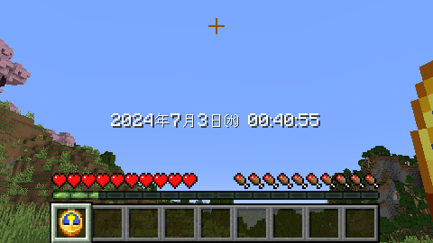

# SynchroClock

[日本語で読む](りーどみー.md)

This is a data pack that provides a clock synchronized with real time.

## Verified Versions

- 1.21

## Usage

The time data synchronizes with the real world every minute (or upon reload).  
However, due to technical constraints, synchronization attempts may occasionally fail.  
If synchronization fails, another attempt will be made at the next interval.

### How to Retrieve Time Data

You can easily retrieve time data from the scoreboard.

1. Year  
   `scoreboard players get Year SynClock`
2. Month  
   `scoreboard players get Month SynClock`
3. Day  
   `scoreboard players get Day SynClock`
4. Weekday (0: Monday, ..., 6: Sunday)  
   `scoreboard players get Weekday SynClock`
5. Hour  
   `scoreboard players get Hour SynClock`
6. Minute  
   `scoreboard players get Minute SynClock`
7. Second  
   `scoreboard players get Second SynClock`
8. UnixTime (seconds elapsed since January 1, 1970)  
   `scoreboard players get UnixTime SynClock`
9. Last successful synchronization time (UnixTime)  
   `scoreboard players get LastSyncUnixTime SynClock`

### Displaying a Sample

You can toggle the sample display on and off with the following command:  
`function #synclock:toggle_sample`  
When you hold the clock in your main hand, the time will be displayed.  
  
The function for displaying the sample is located at `data/synclock/function/sample.mcfunction`.  
Feel free to refer to it.

## Contact

<https://twitter.com/AiAkaishi>

## License

These codes are released under the MIT License, see LICENSE.
